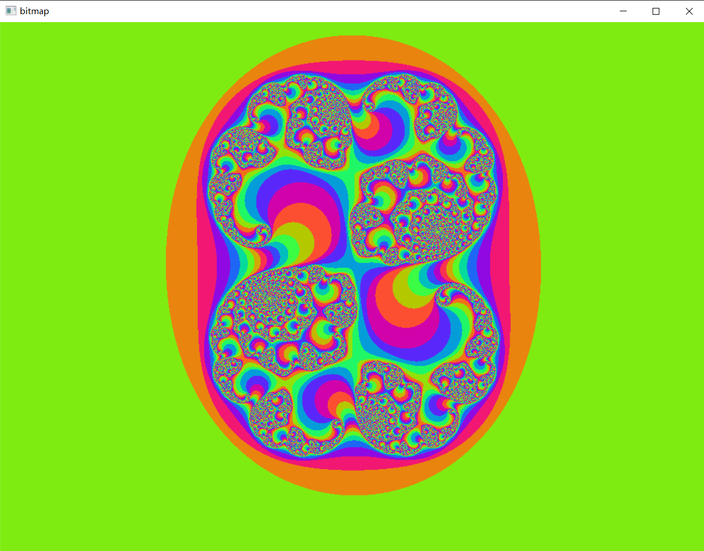

# 实验环境
win10 + vs2017 + CUDA10.1

# Julia set 生成参数
- C：(0.285, 0.01)
- 迭代次数n：200 
- 判断发散阈值：2.0
- 颜色映射函数：

```c++
// 对于复平面上的点，如果它属于Julia set，那么它的juliaValue为0，否则返回迭代次数；它的颜色就是一个关于这个点已经迭代了的次数的三角函数。
ptr[offset * 4 + 0] = 127 * (__sinf(juliaValue)+1);
ptr[offset * 4 + 1] = 127 * (__sinf(juliaValue+2.0/3*PI) + 1);
ptr[offset * 4 + 2] = 127 * (__sinf(juliaValue+4.0/3*PI) + 1);
ptr[offset * 4 + 3] = 255;
```

# 生成结果


# 时间对比
- GPU


- CPU

