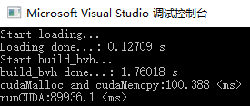

# PicComb Report
 

## 实验硬件与平台
CPU：i5-8500  
GPU：GTX1060，3G显存  
VS2017+CUDA10.1+Win10  

## 主要API
1. runCUDA
   - main()调用cu文件中runCUDA，程序入口
   - 传递必要数据
   - 进行block和thread分配
     - 使用了16*16线程的block
   - 调用'kernel'函数：
> ```C++
> extern "C"
> void runCUDA(int width, int height,  t_linearBVH* d_linear_bvh,	float *_xyzs,float *_rgbsNew,float *_nearest)

1. 'kernel'函数 - updateTargetColors
   - 仿照cpu端的update函数
   - 更新每个thread对应像素的颜色
> ```c++
> __global__ void updateTargetColors(int width, int height,t_linearBVH*d_linear_bvh,float *_xyzs,float *_rgbsNew,float *_nearest)

3. getColorCUDA
   - 根据thread对应的目标图像位置，调用寻找最近点函数 
   - 返回bool，表明是否找到了最近满足条件的最近点
>```c++
> extern "C"
> __device__ __host__ bool getColorCUDA(t_linearBVH*d_linear_bvh, vec3f &xyz, float *nearest, vec3f &cr, int &idx, int &pidx)

4. findNearest2CUDA
   - 寻找离当前位置的最近点，并返回是否找到
   - 调用d_linear_bvh内的query函数
> ```c++
> __device__ __host__ bool findNearest2CUDA(t_linearBVH* d_linear_bvh, xyz2rgb &org, xyz2rgb &ret)

5. query
   - 存在两个query函数，第一个query函数调用第二个query函数，并判断其返回值是否小于minDist
   - 在第二个query函数中，对t_linearBvhNode进行递归搜索（修改为迭代），查找目标位置的对应最近位置点
> ```c++
> __device__ __host__ bool query(xyz2rgb &pt, xyz2rgb &ret)
> __device__ __host__ void query(kBOX &bx, xyz2rgb &dst, xyz2rgb &minPt, float &minDist)

6. 错误检查
   - 为了方便调试，定义cuda error check函数
> ```c++
> //API调用错误处理，可以接受CUDA的API函数调用作为参数
> #define CHECK_ERROR(error) checkCudaError(error, __FILE__, __LINE__)
> //检查CUDA Runtime状态码，可以接受一个指定的提示信息
> #define CHECK_STATE(msg) checkCudaState(msg, __FILE__, __LINE__)


## 计算过程
1. 拷贝数据结构到device端。  
   学习了如何拷贝含有指针的结构体。先cudaMalloc一个t_linearBvhNode数组，将host端的d_linear_bvh中的相同数组cudaMemcpy过去；然后生成一个中间临时对象，将该对象root指针指向该数据；最后cudaMalloc一个device端的cudaMalloc，将该临时对象内容cudaMemcpy给它。  
   此外，对需要用的_xyz，_rgbs，_rgbsNew和_nearest也进行了device端的分配及拷贝。

2. 分配线程，传递数据结构   
   在本次实验中，block和thread的分配如下：
> ```c++
>//init block
>int dimx = 16;
>int dimy = 16;
>dim3 block(dimx, dimy);
>dim3 grid((width + block.x - 1) / block.x, (height + block.y - 1) / block.y);

3. 寻找最近点，将query操作从递归修改为迭代。  
    由于递归操作会占用大量资源，且有人反映CUDA递归四到五层很可能会出错，因此以迭代方式执行遍历，并显式管理递归堆栈。参考[nv devblogs](https://devblogs.nvidia.com/thinking-parallel-part-ii-tree-traversal-gpu/)的内容，我们首先检查当前节点的包围盒是否与目标位置重叠，如果重叠且当前结点是叶子，则修改最近点信息；  
    如果重叠且非叶结点，检查其子节点是否是需要在后续迭代中处理的内部节点。如果只有一个是需要进一步处理的内部节点，我们只需将其设置为当前节点并重新开始。如果有两个子节点，则将左子节点设置为当前节点，然后将右子代推入堆栈；  
    如果没有要遍历的子级或包围盒并不重叠，则弹出一个先前被推入堆栈的节点。当我们弹出的节点的父节点下标为-2（在初始化栈的时候设置的）时，遍历结束，这表明没有更多要处理的节点，搜索结束。  
   
4. 如果找到存在的最近点，更新每个线程对应的像素位置的color。  

## 尝试优化

在修改完基本的cuda程序之后，进行了如下的尝试，期望能够加速：  

*以下操作都基于dilate参数为1.5进行  

1. 去除函数过程中无用的print输出。  
   原本为了debug，在运行过程中输出了大量的每个线程的计算信息。结果发现print影响非常大，查询从240s减少到了149s左右。  
   

2. 将double参数修改为float传递。  
   在query函数调用中，需要传递一个minDist变量，尝试将minDist类型从float修改为double。  
   但是结果发现，耗费时间反而比上一次更多了。考虑到单次测试的时间误差，说明修改此参数格式在当前实验中基本没有影响。  
   

3. 修改stack大小。
   在最开始的设置中，把stack大小设置为256，修改为64之后，搜索时间基本没有变化。  
    
4. 修改query中stack存储的数据结构。  
   原本stack中的存储结构为t_linearBvhNode，尝试修改为int，只记录当前节点的下标即可。同时原本实现中有一些重复的读取传入进来的linear_bvh的操作，现在直接用一个temp node 存放读取的节点，避免多次对global memory访问。修改之后，搜索时间得到了显著提升，从140s变为了89s。  
   

## 实验结果
1. dilate 1.5  
- CPU时间：  
  
- 优化操作后GPU时间：89s(见上图)  
- 老师的CUDA版本在本机上的运行时间：搜索时间~120s  
  
- output:
  

2. dilate 0.1
- CPU时间：
  
- 优化操作后GPU时间：
  
- 老师的CUDA版本在本机上的运行时间：搜索时间~0.7s
  
- output：
  


